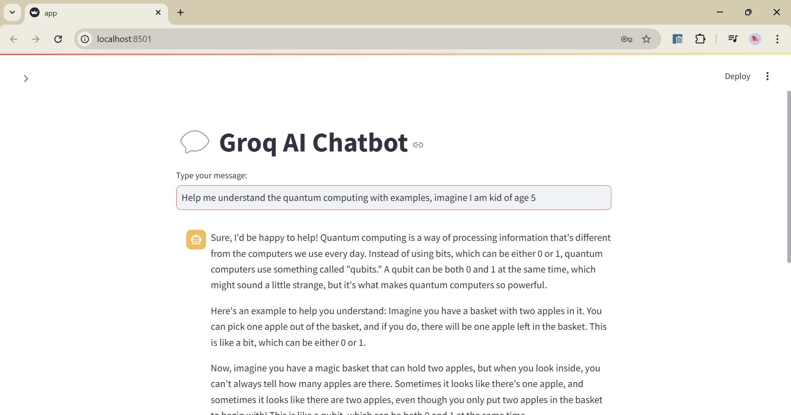
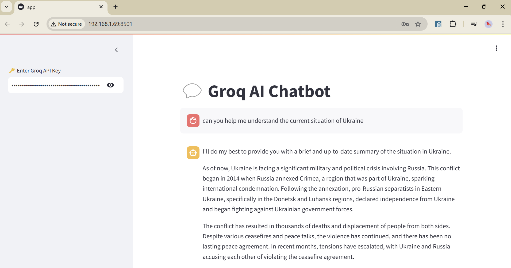

# 🚀 Groq AI Chatbot - Streamlit Web App

  

## 🌟 Overview
This is an **AI-powered chatbot** built using **Groq API** and **Streamlit**. It provides real-time AI responses through a simple, interactive web interface.

🔹 **Built With:**  
✅ Groq API (LLM Inference)  
✅ Streamlit (Web UI)  
✅ Python & Requests (API Calls)  
✅ dotenv (Environment Variable Management)  

## 🎯 Features
✔️ **Conversational AI** using Groq API  
✔️ **Fast & Lightweight** UI with Streamlit  
✔️ **Secure API Key Management** via `.env`  
✔️ **Easy Deployment**  

## 📸 Demo Screenshot
  


## 🛠️ Installation & Setup
### **1️⃣ Clone the Repository**
```bash
git clone https://github.com/SrikanthP126/quick_bot_groq.git
cd groq-chatbot
